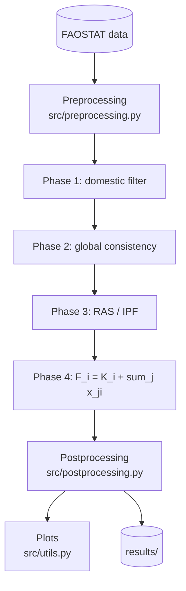

# ALLFED Fertilizer RAS model

[](https://github.com/machteldcarmen/ALLFED-RAS-Fertilizer/actions/workflows/testing.yml)
[](https://opensource.org/licenses/Apache-2.0)

A small, reusable Python package that runs a **4-phase RAS (iterative
proportional fitting) model** of global fertilizer trade for nitrogen (N),
phosphate (P₂O₅) and potash (K₂O). Given a post-shock production vector,
a domestic-demand vector, and a historical bilateral trade matrix, it
produces

* a new **bilateral trade matrix** whose row/column totals match the
  feasible export / import targets and whose structure is as close as
  possible to the historical one, and
* a per-country **final fertilizer availability** vector
  $F_i = K_i + \sum_j x_{ji}$.

The aim is to understand how fertilizer flows would redistribute after a
global shock (e.g. Russian/Belarusian/Ukrainian production losses).

This repository follows the same layout as
[`allfed/pytradeshifts`](https://github.com/allfed/pytradeshifts): all
logic lives in `src/`, and the notebooks under `scripts/` are thin
drivers that just call those functions.

---

## What the model does (short version)

Run independently for each nutrient \( \in \{N, P, K\} \):

**Phase 1 — Domestic first filter.** Each country keeps as much of its
own production as it can. With net balance $B_i = P_i - C_i$,

$$
(K_i, S^*_i, D^*_i) =
\begin{cases}
(C_i,\; B_i,\; 0)           & B_i > 0 \quad (\text{surplus}) \\
(P_i,\; 0,\; |B_i|)         & B_i \le 0 \quad (\text{deficit})
\end{cases}
$$

**Phase 2 — Global consistency.** RAS needs $\sum_i \hat S_i = \sum_i \hat D_j$.
If there is a global shortage, demand is scaled down; if there is a
global surplus, supply is scaled down.

**Phase 3 — RAS / iterative proportional fitting.** Find row multipliers
$r_i$ and column multipliers $c_j$ such that

$$
x_{ij} = r_i \cdot T^0_{ij} \cdot c_j,
\qquad
\sum_j x_{ij} = \hat S_i,
\qquad
\sum_i x_{ij} = \hat D_j.
$$

We alternate

$$
r_i \leftarrow r_i \cdot \frac{\hat S_i}{\sum_j r_i T^0_{ij} c_j},
\qquad
c_j \leftarrow c_j \cdot \frac{\hat D_j}{\sum_i r_i T^0_{ij} c_j}
$$

until the maximum absolute row-/column-sum deviation falls below `tol`.

**Phase 4 — Final availability.**

$$
F_i = K_i + \sum_{j} x_{ji}.
$$

The full derivation, assumptions, and references are in
[`docs/methodology.md`](docs/methodology.md).

---

## Repository layout

```
allfed-fertilizer-ras/
├── .github/workflows/          # CI: automated testing + linting
│   ├── testing.yml
│   └── lint.yml
├── src/                        # all logic lives here
│   ├── model.py                # FertilizerRAS class + run_ras + RASResult
│   ├── preprocessing.py        # FAOSTAT loaders, country filtering, shocks
│   ├── postprocessing.py       # comparisons, summaries, CSV export
│   ├── utils.py                # plotly + matplotlib plots
│   └── README.md
├── scripts/                    # thin notebooks that call src/
│   ├── toy_example.ipynb       # 5-country demo, no external data
│   ├── real_data_nitrogen.ipynb# full FAOSTAT run for one nutrient
│   ├── all_nutrients.ipynb     # N, P, K with a shock
│   ├── validation/             # historical-shock validation notebooks
│   │   ├── fertilizer_validation_2009_crisis.ipynb
│   │   └── fertilizer_validation_russia_ukraine.ipynb
│   └── README.md
├── data/
│   └── README.md               # where to put FAOSTAT bulk CSVs
├── results/                    # generated outputs (git-ignored)
│   └── README.md
├── tests/
│   ├── test_ras.py             # mass-balance and convergence tests
│   └── README.md
├── docs/
│   ├── methodology.md          # full equations & references
│   └── README.md
├── pyproject.toml
├── setup.py                    # pip install -e .
├── requirements.txt            # pip dependencies
├── environment.yml             # conda environment (alternative)
├── .flake8                     # lint config
├── .gitignore
├── LICENSE                     # Apache-2.0
└── README.md                   # this file
```

---

## Installation

Python ≥ 3.10. Standard virtual environment + pip:

```bash
python -m venv .venv
# Windows PowerShell:
.\.venv\Scripts\Activate.ps1
# macOS / Linux:
source .venv/bin/activate

pip install -r requirements.txt
# (or, for an editable install with test tools)
pip install -e ".[dev]"
```

The only hard dependencies are `numpy`, `pandas`, `matplotlib`, `plotly`.

---

## Quickstart

```python
import pandas as pd
from src.model import FertilizerRAS

countries = ['Russia', 'China', 'USA', 'India', 'Brazil']
P  = pd.Series([4_000, 7_000, 5_500, 2_500, 1_000], index=countries)
C  = pd.Series([1_200, 6_500, 4_000, 5_000, 3_500], index=countries)
T0 = pd.DataFrame(
    [[    0,   500,   300, 1_200,   800],
     [  100,     0,   200, 1_500,   400],
     [  200,   300,     0,   400,   800],
     [    0,    50,     0,     0,     0],
     [    0,     0,    50,     0,     0]],
    index=countries, columns=countries,
)

result = FertilizerRAS(P, C, T0).run(verbose=True)
print(result.summary())          # per-country table
print(result.X.round(1))         # new bilateral trade matrix
print(result.F)                  # final fertilizer availability
```

The same pattern works with FAOSTAT data via `src.preprocessing.load_nutrient`.
The notebook [`scripts/real_data_nitrogen.ipynb`](scripts/real_data_nitrogen.ipynb)
walks through an end-to-end run including a Russia/Belarus/Ukraine shock.

---

## Data

The FAOSTAT bulk CSVs are **not** checked into this repository. Download
them from FAOSTAT and place them as described in
[`data/README.md`](data/README.md):

| Dataset                         | FAOSTAT domain                              | Placed under                                          |
|---------------------------------|---------------------------------------------|-------------------------------------------------------|
| Inputs — Fertilizers by Nutrient| Inputs → Fertilizers by Nutrient            | `data/Inputs_FertilizersNutrient_E_All_Data/`         |
| Fertilizers — Detailed Trade    | Trade → Detailed trade matrix               | `data/Fertilizers_DetailedTradeMatrix_E_All_Data/`    |

---

## Tests

```bash
pytest -q
```

The test suite covers the core RAS invariants: row/column totals match
the targets, Phase 1 mass balance holds, and degenerate inputs (zero
production, zero demand, zero trade) produce sensible outputs.

---

## Flowchart



---

## Citation / attribution

If you use this code, please cite the ALLFED institute and link this
repository. The RAS methodology follows standard bi-proportional fitting
(Stone 1961; see [`docs/methodology.md`](docs/methodology.md) for the
full reference list).

---

## License

[Apache 2.0](LICENSE).
